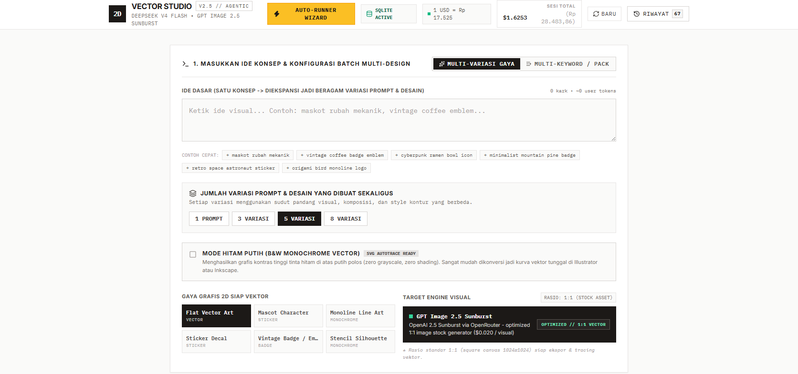
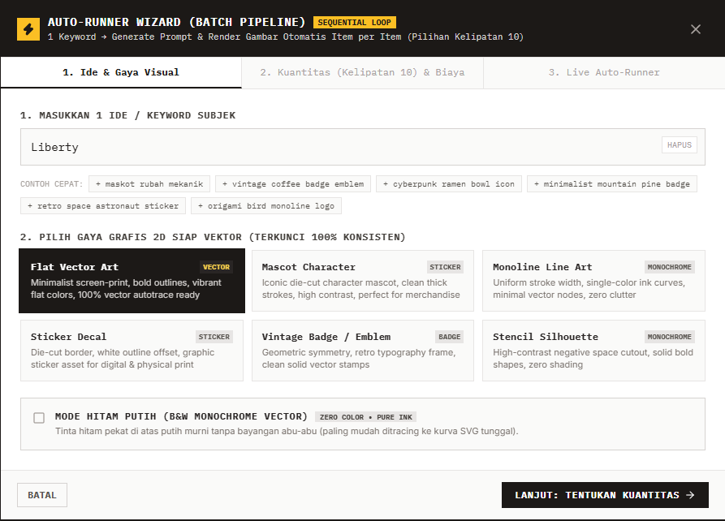

# ⚡ Agentic AI 2D Vector Studio

Studio pembuatan prompt dan aset visual **2D Siap Vektor (Vector-Ready Assets)** berbasis AI lokal mandiri. Dilengkapi dengan sistem **Pra-Estimasi Biaya Terpisah Transparan (Prompt vs Gambar)**, **Auto-Runner Wizard (Pilihan Kelipatan 10 & Bebas)**, dan penyimpanan database **SQLite Lokal**.



---

## 🌟 Fitur Utama

### 1. ⚡ Auto-Runner Wizard (Batch Pipeline Kelipatan 10 & Bebas)
- **Input 1 Keyword**: Masukkan ide subjek singkat (misal: *"maskot rubah mekanik"* atau *"vintage coffee emblem"*).
- **Pilihan Kuantitas Fleksibel**: Tombol cepat kelipatan 10 (`10`, `20`, `30`, `40`, `50`, `60`, `70`, `80`, `90`, `100`), slider dinamis, serta input angka manual.
- **Eksekusi Otomatis Berurutan (Sequential Loop)**: Sistem menghasilkan Prompt AI unik $\rightarrow$ merender visual gambar 1:1 $\rightarrow$ otomatis menyimpan ke database SQLite dan folder disk.
- **Kontrol Antrean Penuh**: Dilengkapi tombol **Jeda (Pause)**, **Lanjutkan (Resume)**, dan **Berhenti (Stop)**.
- **Live Stream Preview**: Hasil gambar langsung muncul satu per satu di galeri begitu selesai tanpa menunggu batch selesai.
- **Batch Download**: Unduh semua gambar format PNG siap pakai dengan 1 klik.



### 2. 🎨 Garansi Konsistensi 6 Preset Gaya 2D Vektor
Terkunci ketat (*Strict Style Locking*) sehingga variasi sudut pandang tidak akan pernah bercampur ke genre visual lain:
1. **Flat Vector Art**: Minimalist screen-print, garis tegas, warna datar padat, siap autotrace SVG.
2. **Mascot Character**: Maskot karakter die-cut dengan garis kontur tebal.
3. **Monoline Line Art**: Garis tunggal presisi dengan ketebalan seragam (*uniform stroke width*).
4. **Sticker Decal**: Stiker grafis dengan border offset putih die-cut.
5. **Vintage Badge / Emblem**: Segel retro geometris simetris dengan linework klasik.
6. **Stencil Silhouette**: Siluet kontras tinggi dengan jembatan *negative space*.

### 3. ⬛ Mode Hitam Putih (B&W Monochrome Vector)
- Menghasilkan tinta hitam pekat 100% di atas latar belakang putih bersih (*zero grayscale, zero shadows*).
- Format paling hemat dan paling sempurna untuk proses *autotrace* vektor menjadi kurva path tunggal di Adobe Illustrator, Inkscape, atau Vectorizer.

### 4. 💰 Pra-Estimasi Biaya Transparan (Prompt vs Gambar Dipisah)
- **Tahap 1 (Prompt Expansion)**: `deepseek/deepseek-v4-flash-0731` ($0.14 / 1M token input & $0.56 / 1M token output).
- **Tahap 2 (Visual Render 1:1)**: `openai/gpt-image-2.5-sunburst` ($0.020 / visual 1:1).
- Kalkulasi live dalam **USD** dan **IDR** sebelum pengguna menekan tombol generate.

### 5. ⏳ Background Task Queue Worker & Offline Auto-Cancellation
- **Bebas Klik Card Mana Saja**: Pengguna dapat bebas mengklik tombol render pada beberapa kartu sekaligus tanpa khawatir terkena rate limit AI (HTTP 429).
- **FIFO Background Execution**: Sistem mengantrekan permintaan (`[ ⏳ Antrean ke-#1 ]`, `[ ⏳ Antrean ke-#2 ]`) dan mengeksekusinya secara berurutan satu per satu dengan jeda aman 600ms.
- **Batalkan Per Card / Batalkan Semua**: Pengguna dapat membatalkan item tertentu atau semua antrean kapan saja.
- **🛡️ Auto-Cancel Saat Offline**: Jika koneksi internet terputus di tengah jalan, seluruh antrean pending otomatis dibatalkan seketika demi menjaga integritas data dan keamanan kuota.

### 6. 📜 Multi-Version Prompt Timeline & History Switcher
- **Prompt Lama Tidak Hilang**: Setiap kartu menyimpan riwayat lengkap versi prompt (`v1`, `v2`, `v3`...) saat pengguna meregenerasi prompt AI.
- **Tampilan Terstruktur & Ergonomis**: Prompt aktif terpilih berada di posisi atas dengan kontras penuh, sedangkan versi lama diletakkan di bawahnya dengan tampilan semi-transparan (`opacity-65`).
- **Scrollable Timeline (Anti-Panjang)**: Ketinggian riwayat dibatasi dalam container scroll vertikal (`max-h-52`) sehingga kartu tetap rapi dan tidak memanjang ke bawah meskipun di-generate hingga belasan kali.
- **Quick Switch & Copy**: Dilengkapi tombol **`[ ↺ Gunakan ]`** untuk beralih ke versi lama dan tombol **`[ 📋 Salin ]`** per versi.
- **Tersimpan ke SQLite**: Riwayat versi prompt otomatis tersimpan permanen di database `data/prompt_studio.db`.

### 7. 🌐 Kurs Real-Time Harian (api.co.id)
- Sistem sinkronisasi kurs USD ke IDR dinamis via `api.co.id` dengan caching 1x per hari di SQLite lokal.

### 8. 💾 Local-First SQLite & File Storage
- Metadata prompt, token aktual, dan riwayat biaya tersimpan di `data/prompt_studio.db` via `better-sqlite3` + `Drizzle ORM`.
- File visual tersimpan rapi per tanggal di folder `data/outputs/YYYY-MM-DD/`.

---

## 🛠️ Tech Stack

| Layer | Teknologi |
|---|---|
| **Runtime & Tooling** | Node.js (v20+ LTS), TypeScript, tsx |
| **Frontend (FE)** | React 19, Vite, Tailwind CSS, Lucide React |
| **Backend (BE)** | Fastify (Port 3001) |
| **Database** | SQLite Lokal (`better-sqlite3`), Drizzle ORM |
| **AI LLM Engine** | OpenRouter API (`deepseek/deepseek-v4-flash-0731` & `openai/gpt-image-2.5-sunburst`) |
| **Currency API** | api.co.id Exchange Rates (Cached Daily) |

---

## 📁 Struktur Direktori

```text
GPTIMAGEGENERATE/
├── .env                        # Konfigurasi environment lokal & API Key
├── .env.example                # Template konfigurasi environment
├── AGENTS.md                   # Panduan arsitektur & AI Agent
├── DESIGN.md                   # Panduan desain Industrial Minimalism
├── README.md                   # Dokumentasi proyek ini
├── docs/                       # Dokumentasi & Aset Gambar
│   └── images/                 # Folder penyimpanan gambar screenshot README.md
├── package.json                # Dependencies & npm scripts
├── vite.config.ts              # Konfigurasi Vite & API proxy ke Fastify (:3001)
├── data/
│   ├── prompt_studio.db        # File Database SQLite Lokal
│   └── outputs/
│       └── YYYY-MM-DD/         # File PNG hasil generate tersimpan per tanggal
├── server/                     # Backend Fastify + SQLite
│   ├── index.ts                # Entry point server (Port 3001)
│   ├── db/
│   │   ├── client.ts           # Inisialisasi better-sqlite3 & Drizzle
│   │   └── schema.ts           # Skema tabel prompts & exchange_rates
│   ├── routes/
│   │   └── prompts.route.ts    # REST API endpoints
│   └── services/
│       ├── prompt-engine.service.ts # Engine ekspansi prompt DeepSeek v4
│       ├── image-generator.service.ts # Engine visual GPT Image 2.5
│       └── currency.service.ts # Layanan kurs real-time api.co.id
└── src/                        # Frontend React + Vite
    ├── App.tsx                 # Main application layout & state
    ├── components/
    │   ├── Navbar.tsx          # Top bar, kurs harian, & tombol Auto-Runner
    │   ├── AutoRunnerWizardModal.tsx # Modal Wizard 3 langkah (1-50 Batch)
    │   ├── PromptInput.tsx     # Form ide, mode batch, & checklist B&W
    │   ├── CostEstimationCard.tsx # Pra-estimasi token & biaya terpisah
    │   ├── UnifiedVariationCard.tsx # Kartu mandiri side-by-side
    │   ├── BatchCardsGrid.tsx  # Grid galeri hasil generate
    │   └── HistorySidebar.tsx  # Drawer riwayat prompt dari SQLite
    ├── hooks/
    │   ├── useAutoRunner.ts    # Hook eksekusi loop 1-50 dengan pause/stop
    │   ├── usePromptGenerator.ts # Hook CRUD prompt & render gambar
    │   ├── useCostEstimator.ts # Hook live token counter
    │   └── useExchangeRate.ts  # Hook kurs USD -> IDR
    └── utils/
        ├── costCalculator.ts   # Formula kalkulasi tarif token & visual
        └── vectorGraphicGenerator.ts # Engine fallback render SVG 2D
```

---

## 🚀 Panduan Instalasi & Menjalankan Aplikasi

### 1. Prasyarat
- Node.js versi 20+ LTS terinstal di komputer.

### 2. Clone & Install Dependencies
```bash
npm install
```

### 3. Konfigurasi Environment (`.env`)
Salin file `.env.example` menjadi `.env`:
```bash
cp .env.example .env
```

Buka file `.env` dan masukkan API Key OpenRouter Anda:
```env
# OpenRouter API Key
OPENROUTER_API_KEY=sk-or-v1-xxxxxxxxxxxxxxxxxxxxxxxxxxxxxxxx

# Model AI (Default)
OPENROUTER_PROMPT_MODEL=deepseek/deepseek-v4-flash-0731
OPENROUTER_IMAGE_MODEL=openai/gpt-image-2.5-sunburst

# Kurs Default USD ke IDR
USD_TO_IDR_RATE=16000
ENABLE_DYNAMIC_EXCHANGE_RATE=true

# Port Server
PORT=3001
NODE_ENV=development
```

### 4. Jalankan Aplikasi
Jalankan Frontend (Vite) dan Backend (Fastify) secara bersamaan dengan satu perintah:
```bash
npm run dev
```

Buka browser di:
```text
http://localhost:5173
```

---

## 🔌 Spesifikasi REST API

| Method | Endpoint | Fungsi |
|---|---|---|
| `GET` | `/api/prompts` | Mengambil seluruh riwayat kartu dari SQLite |
| `POST` | `/api/prompts` | Menyimpan / memperbarui (*upsert*) kartu variasi |
| `POST` | `/api/prompts/batch` | Menyimpan banyak kartu variasi sekaligus ke SQLite |
| `POST` | `/api/generate-prompt` | Ekspansi Prompt AI via DeepSeek v4 Flash |
| `POST` | `/api/generate-image` | Generate visual 1:1 via GPT Image 2.5 Sunburst |
| `GET` | `/api/currency/exchange-rate` | Ambil kurs USD $\rightarrow$ IDR harian dari `api.co.id` |
| `GET` | `/api/currency/history` | Riwayat catatan kurs harian di SQLite |
| `DELETE` | `/api/prompts/:id` | Menghapus kartu tertentu dari database SQLite |
| `DELETE` | `/api/prompts` | Membersihkan seluruh riwayat SQLite |
| `GET` | `/api/health` | Health check server Fastify & database SQLite |

---

## 📄 Lisensi
Private & Proprietary — Dikembangkan khusus untuk alur kerja pembuatan aset 2D siap vektor profesional.
